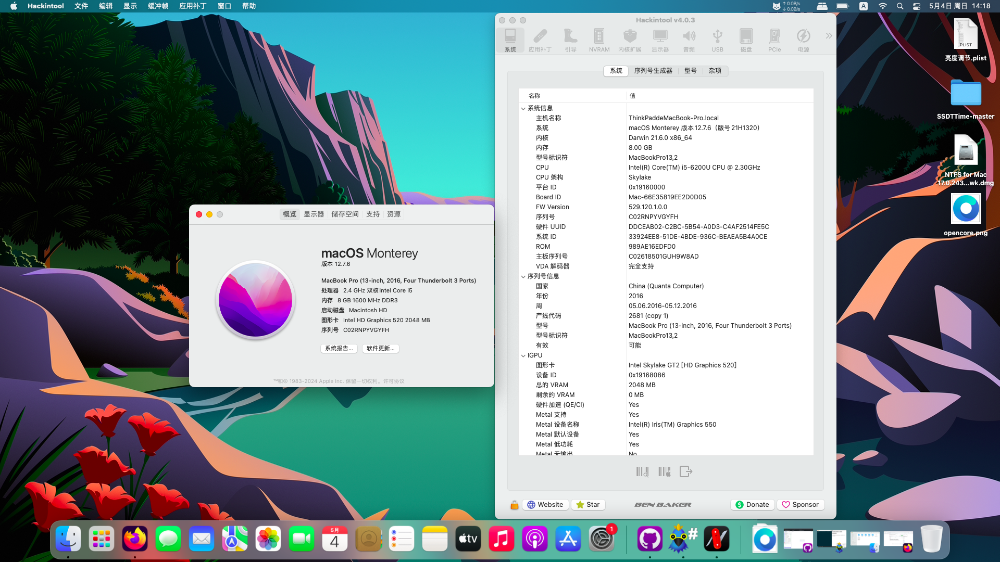

# ThinkPad-E560-i5-6200U-Hackintosh
应用于联想ThinkPad E560 的[rEFInd](https://www.rodsbooks.com/refind/index.html)+OpenCore 1.0.4的黑苹果引导 支持macOS Monterey

注意：
- 此EFI不含三码 实际使用时请自行使用[OCAT](https://github.com/ic005k/OCAuxiliaryTools)生成
- 因未对内置键盘定制相关补丁 因此键盘上的部分功能键不起作用


### 配置清单
|类型|型号|规格|
|---|---|---|
|CPU|Intel Core i5-6200U|2.40 GHz|
|内存|Samsung M471B5173EB0-YK0 ×2|1600 MHz|
|SSD|Lenovo 2.5 SATA SSD(SN14546)|512 GB|
|iGPU|Intel HD Graphics 520|2048 MB|
|dGPU|AMD Radeon R7 M370|2048 MB|
|网卡|Intel I219-V|1000 Mbps|
|Wi-Fi|Intel Wi-Fi AC-3165|433 Mbps|
|声卡|Conexant CX20753|立体声|
|操作系统|macOS Monterey|12.0-12.7.6|
|BIOS|Phoenix UEFI R00ET69W(1.44)|2022/06/13|

#### 无法工作的部分
- 隔空投送和接力：需要破解BIOS网卡白名单，更换博通WI-FI网卡，部分型号需要搭配[AirportBrcmFixup](https://github.com/acidanthera/AirportBrcmFixup)驱动使用。
- HDMI接口：未解决
- VGA接口：无解
- 独立显卡：无解
- DRM硬解：无解

#### 附注事项
- 经测试，此机型的BIOS不能直接启动OpenCore(会报错)，需要使用rEFInd作为二次引导才可以。
- 睡眠唤醒未解决，如果出现睡死问题，可尝试在终端里输入以下命令以关闭睡眠功能：
```
sudo pmset -a sleep 0
sudo pmset -a hibernatemode 0
sudo pmset -a disablesleep 1
```
- 此EFI仅在**Monterey**中测试通过，其它版本的macOS未做测试。